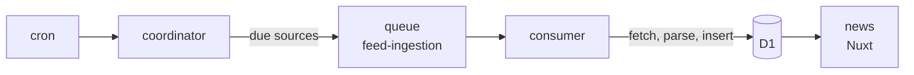

# Architecture

The project has three Cloudflare Workers and one D1 database. Two workers ingest
articles. The third is the web app, which only reads.



| Worker                    | Folder                                          | What it does                                          |
| ------------------------- | ----------------------------------------------- | ----------------------------------------------------- |
| `news-reader-coordinator` | [`workers/coordinator`](../workers/coordinator) | Picks the sources that are due and queues them.       |
| `news-reader-consumer`    | [`workers/consumer`](../workers/consumer)       | Fetches, parses and stores each source.               |
| `news`                    | root                                            | Serves the interface and the read-only [API](api.md). |

The ingest logic is in the package [`packages/feeds`](../packages/feeds)
(`@news-reader/feeds`). The two workers only orchestrate it.
[`scripts/ingest.ts`](../scripts/ingest.ts) uses the same package to ingest
locally, without a queue. [Repository layout](layout.md) lists the other
folders.

## The ingest flow

1. **Cron.**
   [`workers/coordinator/cloudflare.config.ts`](../workers/coordinator/cloudflare.config.ts)
   schedules the coordinator with `*/15 * * * *`.
2. **Coordinator.**
   [`workers/coordinator/src/index.ts`](../workers/coordinator/src/index.ts)
   reads the sources with `enabled = 1` and keeps those that
   [`dueSources`](../packages/feeds/src/schedule.ts) marks as due for that run
   (see [polling cadence](sources.md#polling-cadence)). It splits them into
   groups of 40 and sends each group to the `feed-ingestion` queue as one
   `{ sources }` message. When no source is due, it sends nothing.
3. **Consumer.**
   [`workers/consumer/src/index.ts`](../workers/consumer/src/index.ts) receives
   one message per invocation (`maxBatchSize: 1`). It processes the message's
   sources in parallel with `Promise.allSettled`, so one failing source does not
   stop the others. It acknowledges the message (`ack`) when every source
   resolves and asks the queue to deliver it again (`retry`) when one rejects.
4. **Source.** [`processSource`](../packages/feeds/src/process.ts) does the work
   for one source:

   ```text
   fetchItems ⇢ parseItem ⇢ INSERT OR IGNORE ⇢ UPDATE sources
   ```

   - `fetchItems` downloads by the source's `kind`: an XML feed or an Instagram
     account.
   - `parseItem` turns each item into a normalized article, using the parser
     named in the `parser` column.
   - `INSERT OR IGNORE` stores the articles that have a `guid`, a `title` and a
     `link`. The unique key `(source_id, guid)` prevents duplicates, so a stored
     article is never updated.
   - When everything works, `last_fetched_at` takes the current time and
     `last_error` becomes `NULL`.
   - A failed check is recorded instead. See [failures](sources.md#failures).

A source that fails is logged as `fetch failed` and stored in `last_error`. A
source that cannot be downloaded or parsed resolves, so its message is
acknowledged and the source waits for its next scheduled check. A failure to
write to the database rejects, so the message is delivered again, up to the
queue's `maxRetries` (3). The retry runs every source of the message again, and
the articles already stored are ignored. `processSource` logs one line per
source and the coordinator logs how many sources it dispatched. All three
workers have Cloudflare observability enabled.
