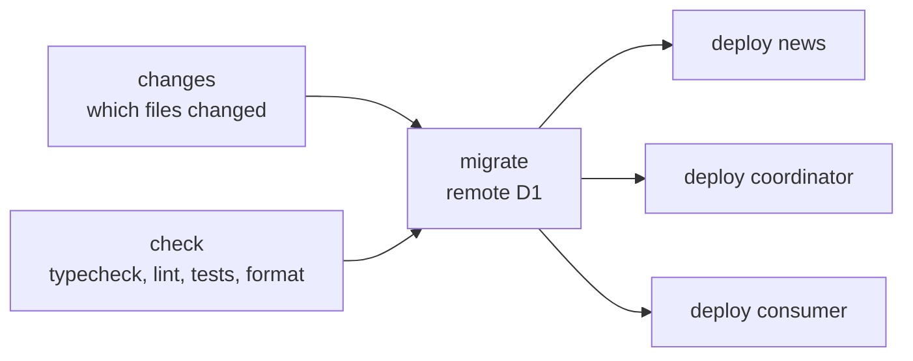

# Deployment

[`.github/workflows/deploy.yml`](../.github/workflows/deploy.yml) runs on every
push to `master` and deploys only what the push changed. Only one deployment
runs at a time. A new one waits for the running one and does not cancel it.

| Job       | What it does                                                         |
| --------- | -------------------------------------------------------------------- |
| `changes` | Compares the push with the last successful run and selects the jobs. |
| `check`   | Runs the typecheck, lint, tests and format check on every push.      |
| `migrate` | Runs `bun run db:migrate` and applies the pending migrations to D1.  |
| `deploy`  | Runs `bun run deploy` for each selected worker in the matrix.        |

`migrate` and `deploy` wait for `check`. `deploy` also waits for `migrate`, but
runs when `migrate` is skipped. A failure in any earlier job stops them. The
failure of one worker does not cancel the others (`fail-fast: false`).

## What each push runs

The filter in the `changes` job lists the files each worker is built from. A
worker is deployed when any of them changed:

- `news` (root): `app`, `server` except `server/db`, `packages/feeds`,
  `package.json`, `tsconfig.json`, `nuxt.config.ts`, `cloudflare.config.ts` and
  `wrangler.config.ts`.
- `news-reader-coordinator`: `workers/coordinator` and `packages/feeds`.
- `news-reader-consumer`: `workers/consumer` and `packages/feeds`.

`bun.lock`, `server/db/database.json` and the
[setup action](../.github/actions/setup/action.yml) rebuild all three. `migrate`
runs when `server/db/migrations`, `server/db/database.json` or
`scripts/migrate.ts` change. A push that changes none of these (documentation,
tests) runs `check` and nothing else.

The push is compared with the head commit of the last successful run of the
workflow on `master`, not with the commit before the push. A run that fails or
that a newer push replaces in the queue is not successful, so the next run
deploys its changes too. When no successful run exists, everything deploys.

To deploy all three workers and apply the migrations without a change, run the
workflow by hand from the Actions tab (`workflow_dispatch`). The `migrate` and
`deploy` jobs run only on `master`, so a manual run on another branch does
nothing but `check`.

At the root, `bun run deploy` builds Nuxt and runs `cf deploy --prebuilt`. In
the ingest workers, it runs `cf deploy`.

Every job prepares its environment with the local action
[`.github/actions/setup`](../.github/actions/setup/action.yml): Node 24, the Bun
version pinned in [`mise.toml`](../mise.toml) and
`bun install --frozen-lockfile`.

## Secrets

The `migrate` and `deploy` jobs read two repository secrets:

- `CLOUDFLARE_API_TOKEN`
- `CLOUDFLARE_ACCOUNT_ID`

The workflow sets `CF_SEND_TELEMETRY: "false"` for the `cf` CLI.

## Migrations

Migrations run before the workers. See the
[migration rules](database.md#migrations). To apply migrations outside the
workflow, run `bun run db:migrate` with the same two variables in the
environment.

## Other automation

- [`analisis_codeql.yml`](../.github/workflows/analisis_codeql.yml) runs
  GitHub's code analysis on every pull request, on every push to `master`, on
  Fridays at 11:00 UTC and on demand.
- [`dependabot.yml`](../.github/dependabot.yml) checks the Bun dependencies and
  the GitHub Actions daily.
