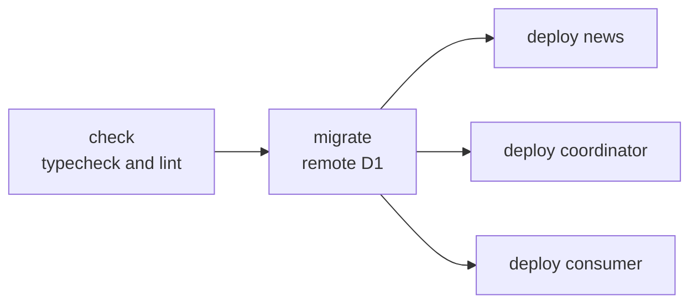

# Deployment

[`.github/workflows/deploy.yml`](../.github/workflows/deploy.yml) deploys on
every push to `master`. Only one deployment runs at a time. A new one waits for
the running one and does not cancel it.

| Job       | What it does                                                        |
| --------- | ------------------------------------------------------------------- |
| `check`   | Runs `bun run typecheck` and `bun run lint`.                        |
| `migrate` | Runs `bun run db:migrate` and applies the pending migrations to D1. |
| `deploy`  | Runs `bun run deploy` for each worker in the matrix.                |

Each job waits for the previous one (`needs`). The `deploy` matrix has three
workers. The failure of one does not cancel the others (`fail-fast: false`):

| Worker                    | Folder                |
| ------------------------- | --------------------- |
| `news`                    | `.`                   |
| `news-reader-coordinator` | `workers/coordinator` |
| `news-reader-consumer`    | `workers/consumer`    |

At the root, `bun run deploy` builds Nuxt and runs `cf deploy --prebuilt`. In
the ingest workers, it runs `cf deploy`.

Every job prepares its environment with the local action
[`.github/actions/setup`](../.github/actions/setup/action.yml): Node 24, Bun and
`bun install --frozen-lockfile`.

## Secrets

The `migrate` and `deploy` jobs read two repository secrets:

- `CLOUDFLARE_API_TOKEN`
- `CLOUDFLARE_ACCOUNT_ID`

The workflow sets `CF_SEND_TELEMETRY: "false"` for the `cf` CLI.

## Migrations

Migrations run before the workers. See the
[migration rules](database.md#migrations). To apply migrations outside the
workflow, run `bun run db:migrate` with the same two variables in the
environment.

## Other workflows

- [`analisis_codeql.yml`](../.github/workflows/analisis_codeql.yml) runs
  GitHub's code analysis on every pull request, on every push to `master`, on
  Fridays at 11:00 and on demand.
- [`dependabot.yml`](../.github/dependabot.yml) checks the Bun dependencies and
  the GitHub Actions daily.
