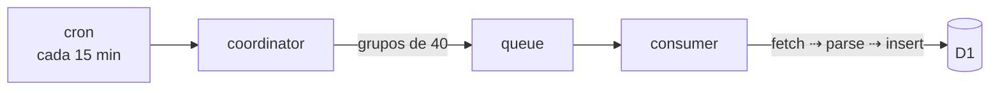

# RSS para físicxs

[](https://github.com/caefisica/news/actions/workflows/deploy.yml)

RSS para físicxs reúne becas, convocatorias, eventos y oportunidades académicas
para estudiantes e investigadores de física en Perú. El proyecto consume feeds
RSS y Atom de universidades, revistas, blogs institucionales y portales
públicos, normaliza los artículos y los sirve desde una interfaz web simple.



Un cron ejecuta el `coordinator` cada 15 minutos. Este worker lee las fuentes
activas desde D1 y las envía a una cola en grupos de 40. El `consumer` escucha
la cola y procesa las fuentes en paralelo.

Cada fuente sigue este flujo:

```text
fetch XML ⇢ parse ⇢ normalización ⇢ INSERT OR IGNORE
```

Los feeds se parsean sin dependencias externas. Cada fuente define su parser en
la base de datos. Actualmente existen parsers para feeds estándar, Blogger y
algunos feeds inconsistentes de `gob.pe`.

## Cuentas de Instagram

Varias instituciones peruanas publican solo en Instagram, así que una fuente
también puede ser una cuenta. La columna `kind` de `sources` dice cómo se
obtiene: `feed` lee RSS o Atom e `instagram` lee las últimas publicaciones de la
cuenta. El parser sigue indicando cómo se leen los artículos.

Para agregar una cuenta basta una fila en una migración nueva:

```sql
INSERT OR IGNORE INTO sources (name, url, kind, parser, category, language) VALUES
  ('@cuenta', 'https://www.instagram.com/cuenta/', 'instagram', 'instagram', 'institucional', 'es');
```

La consulta es anónima: no usa inicio de sesión, cookies ni tokens. Pide una vez
por cuenta y por revisión las 12 publicaciones más recientes.

- Una publicación pertenece a la cuenta solo si su autor es la cuenta. Se omiten
  las publicaciones en colaboración de otras cuentas.
- El título es la primera línea del texto, cortada en un fin de oración o en una
  palabra. Sin texto, es «Publicación de @cuenta». El resumen es el texto
  completo y la imagen es la portada.
- La fecha sale del código de la publicación, que contiene la hora de creación.
  En un reel puede quedar hasta un minuto antes de la hora que muestra
  Instagram.
- Instagram limita las IP de centros de datos, y un Worker usa una. Por eso las
  cuentas se revisan cada hora (`INSTAGRAM_INTERVAL_MINUTES` en
  `packages/feeds/src/schedule.ts`) y no en cada ejecución del cron.
- Un bloqueo, una redirección al inicio de sesión, un límite de frecuencia o una
  respuesta vacía no borran los artículos guardados ni cuentan como revisión
  correcta. El motivo se guarda en `sources.last_error` y se muestra en
  `/sources`.

El frontend usa Nuxt 4 sobre Cloudflare Workers (`cloudflare_module`). Las rutas
`/api/articles` y `/api/sources` leen datos desde D1 y los sirven al cliente.

## Desarrollo local

```sh
git clone https://github.com/caefisica/news.git
cd news

bun install
bun run db:migrate:local
bun run dev
```

Para ejecutar la ingesta localmente:

```sh
bun run ingest
```

`bun run dev` vuelve a compilar la app en cada cambio y la sirve con los
bindings locales. La base local se guarda en `.wrangler/state`, la misma que
usan `db:migrate:local` e `ingest`. La ingesta local procesa las fuentes
directamente, sin pasar por la cola.

El nombre y el id de la base D1 están en `server/db/database.json`. Los tres
`cloudflare.config.ts` y `scripts/migrate.ts` los leen de ahí.

El proyecto usa el CLI [`cf`](https://developers.cloudflare.com/cf/) de
Cloudflare. Cada worker tiene su propio `cloudflare.config.ts`: el de la raíz
configura la app web y los de `workers/consumer` y `workers/coordinator`
configuran los workers de ingesta. El `wrangler.config.ts` raíz indica cómo
compilar Nuxt. Los tipos del runtime y de los bindings se generan con
`bun run types` (`cf workers types`) en `.cloudflare/types`, y
`bun run typecheck` los regenera antes de comprobar.

## Despliegue

GitHub Actions despliega en cada push a `master`, un despliegue a la vez:

1. comprueba los tipos y el lint (`bun run typecheck`, `bun run lint`);
2. aplica las migraciones pendientes en D1 remoto (`bun run db:migrate`);
3. despliega los tres workers con `cf deploy`.

Necesita los secretos `CLOUDFLARE_API_TOKEN` y `CLOUDFLARE_ACCOUNT_ID`.
